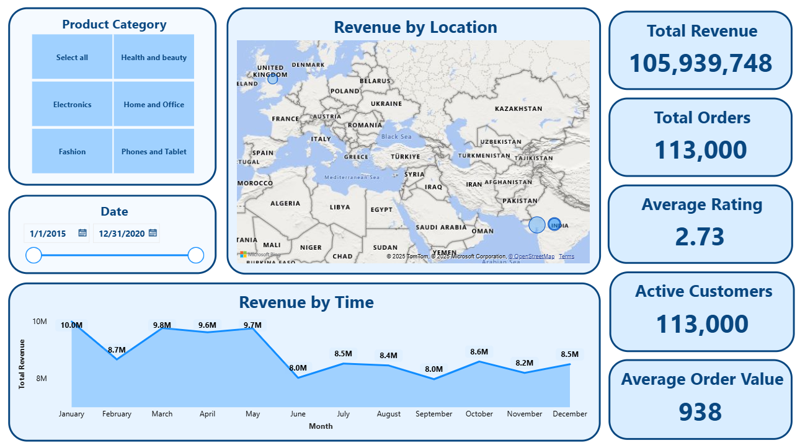
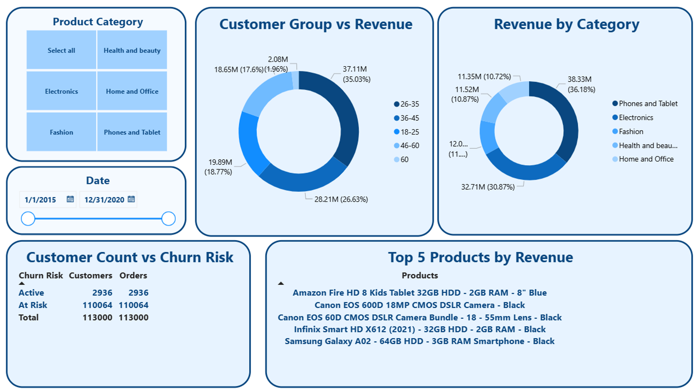
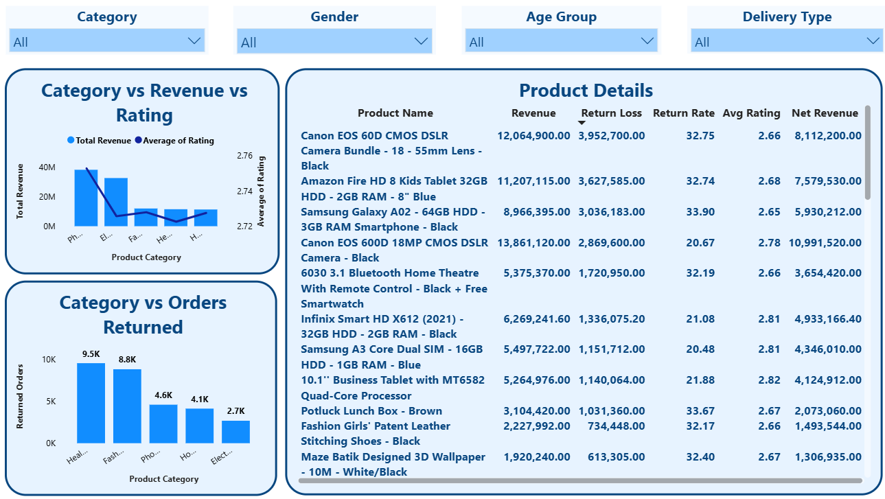
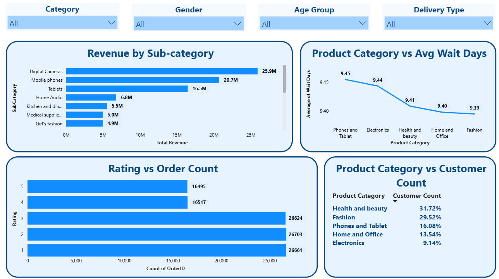
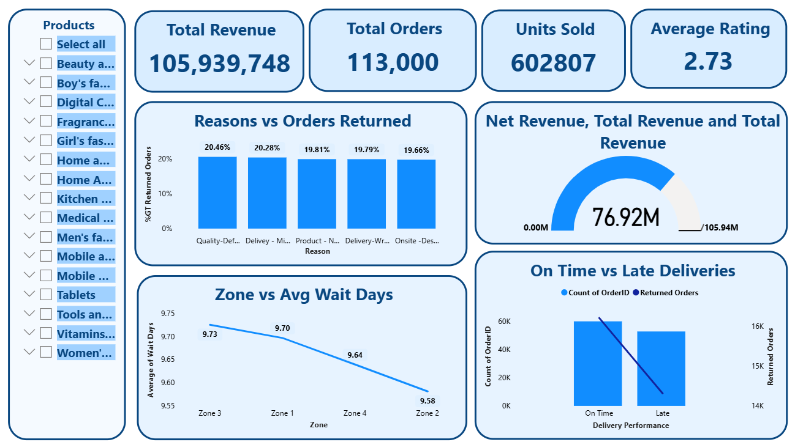
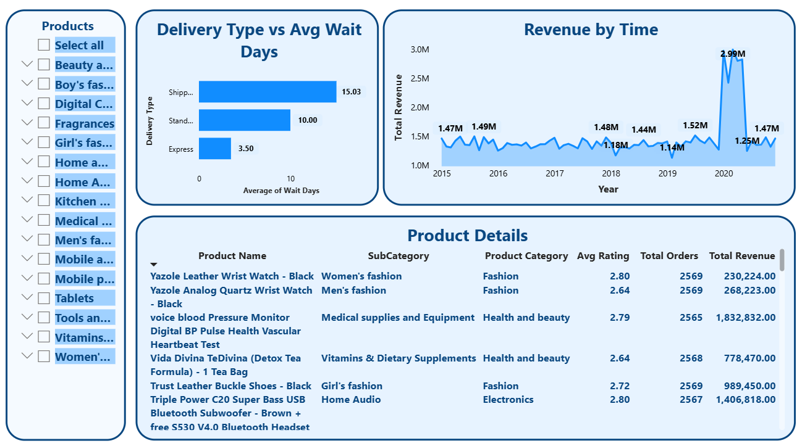

# 📦 Amazon E-Commerce Performance Analysis – Power BI Project

### 🎥 Video Walkthrough

[🎬 Walkthrough Video](http://www.linkedin.com/in/naveenvarjani)

*A short walkthrough explaining data model, dashboard tabs, KPIs, insights, and business strategy recommendations.*

---

### 📘 Project Overview

A Power BI–based e-commerce performance analysis project that uncovers business insights from Amazon's order, customer, and delivery data.

🌟 **Goal**: Identify issues in product returns, delivery efficiency, revenue trends, and customer satisfaction to enable strategic improvements.

---

### 🖼️ Power BI Dashboard Snapshots

#### Power BI Dashboard - Main Tab Part 1  

#### Power BI Dashboard - Main Tab Part 2  

#### Power BI Dashboard - Product Tab Part 1  

#### Power BI Dashboard - Product Tab Part 2  

#### Power BI Dashboard - Individual Product Tab Part 1  

#### Power BI Dashboard - Individual Product Tab Part 2  

---

### 🧰 Tools & Techniques Used

**👩‍💻 Power BI Desktop** – For visual dashboards and storytelling  
**⚖️ DAX** – For KPIs like return %, customer risk, delivery delay, and time intelligence  
**🔢 SQL** – For advanced queries like customer segmentation, revenue growth, and return adjustments  
**📃 Power Query** – For data cleaning, handling missing values, and deriving new columns (wait time, churn risk, etc.)

---

### 🧭 Dashboard Storyline

#### 🔍 Business Challenges
- Inconsistent revenue growth across time
- High product return rates in key categories
- Long wait times and low ratings in certain orders

#### 🌐 Dashboard Tabs
- **Main Tab**: Revenue trends, customer churn, delivery wait times
- **Product Tab**: Returns, ratings, subcategory performance
- **Individual Product Tab**: Sales breakdown, review pattern, product-specific losses

---

### 🌟 Key KPIs

- **Total Revenue**: ₹105,939,748  
- **Total Orders**: 113,000  
- **Return Revenue**: ₹29,015,716 (27.38%)  
- **Average Customer Rating**: 2.73  
- **Active Customers**: 2.6% (rest marked at-risk)  
- **Avg. Delivery Time**:
  - Express: 3.5 days  
  - Standard: 10 days  
  - Shipped from Abroad: 15 days  

---

### 🔎 Key Insights

- 📈 **Revenue** peaks in May & Nov; dips in June & Sept (seasonality effect)
- 🧵 **Returns** highest in Health & Beauty and Fashion
- ⏱️ **Delays** significant in “Shipped from Abroad”
- 🚮 **Churn Risk**: 97.4% customers inactive in last 60 days
- ⭐ **Rating Spread** mostly between 2 and 3
- ❓ **Top Return Reason**: Quality - Defective Item
- 👥 Major buyers are aged 26–45  
- 🗺️ **Zone 3** leads in sales, others underperforming

---

### 📉 Visual Highlights

- 📊 Line Chart: Monthly Revenue vs Return Loss  
- 📌 Table: Category-wise Revenue vs Returns  
- 🗺️ Heatmap: Zone & Location-wise Sales  
- 🛍️ Bar Chart: High Price–Low Sales Product Highlights  
- ⭐ Histogram: Rating Spread by Frequency  
- 🎯 Pie Chart: Return Rate by Product Category  
- 🔁 Funnel Chart: Return Reasons (Top 5)  
- 📆 Line Graph: Month-over-Month Revenue (2020)  
- 📋 Table: Product vs Avg. Rating vs Revenue  
- 👥 Age Group Distribution of Customers  
- 🧮 Card Visuals: Total Revenue, Orders, Return %, Avg. Order Value  

---

### 📌 Strategic Suggestions

- 💪 Improve packaging & QA for high-return categories (Fashion, Beauty)
- ⏳ Optimize overseas delivery wait times
- 🚨 Re-engage at-risk customers with offers & reminders
- 🔄 Loyalty campaigns for frequent buyers
- 📊 Add more rating metrics to improve review transparency
- 🛒 Discount high-rated but low-selling products to boost turnover

---

### 🌟 Outcome

This project demonstrates **end-to-end business intelligence** using Power BI — converting raw e-commerce data into actionable business strategies.

> 🧠 Showcased practical Power BI skills, DAX expertise, storytelling ability, and domain understanding — tailored to real-world business challenges.

---

### 🙋‍♂️ About Me

I'm Naveen Varjani — a data enthusiast passionate about uncovering stories from data and solving real-world problems using analytics.

📌 [LinkedIn](https://www.linkedin.com/in/naveenvarjani) • [GitHub](https://github.com/naveenvarjani) • ✉️ Email me

